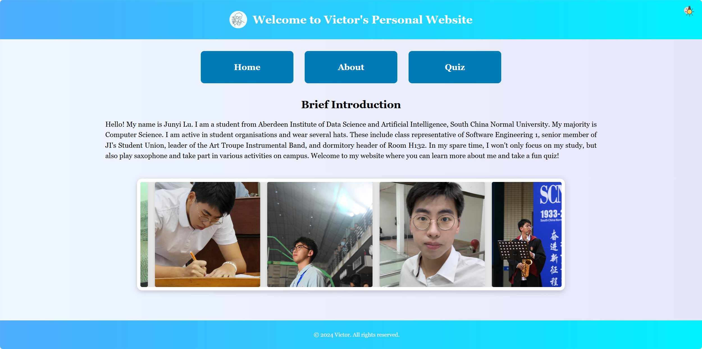
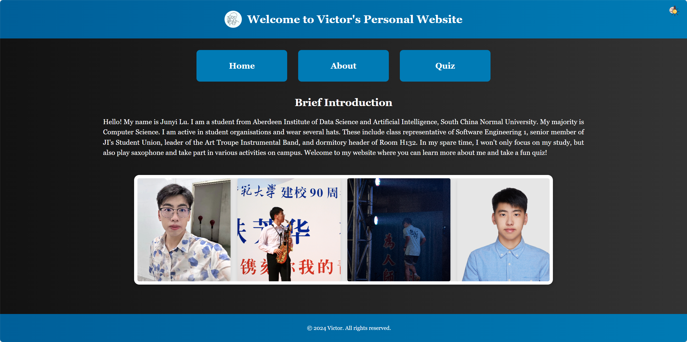
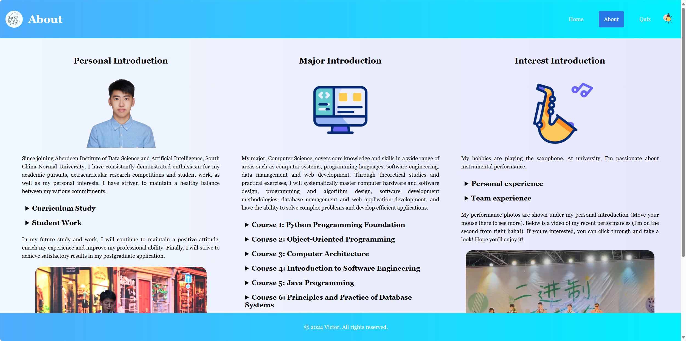
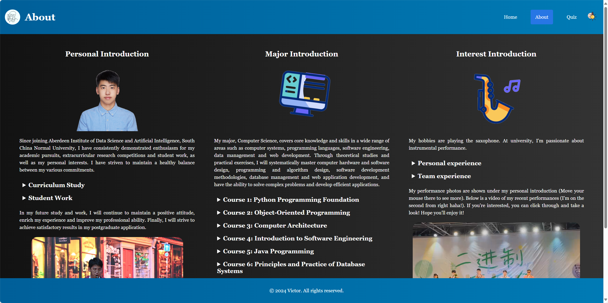
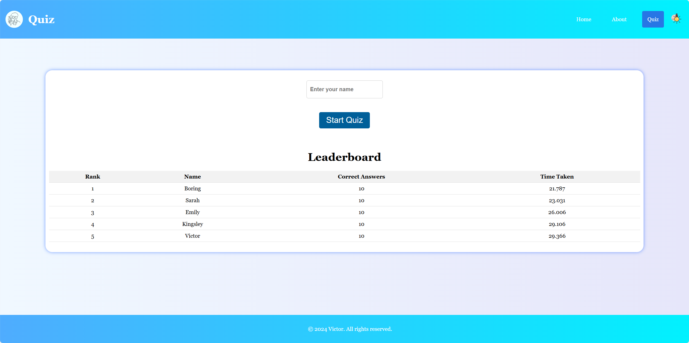
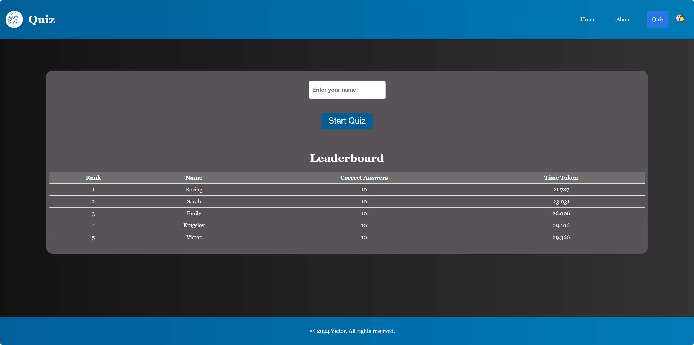

# Project Report of Web Application Assignment

# Overall Design of My Website
For my website project, I aim to craft a three-page personal site that not only serves as an online portfolio but also engages users with interactive elements. I'll firstly introduce some common design of the whole website.

### 1. Head Icon and Avatar
In order to customize my personal website, I designed several small uniform elements to make it more attractive and unique.         
```html
<link rel="icon" href="img/favicon.png" type="image/png">

<div class="avatar">
    
</div>
``` 

### 2. Styles of Header, Main and Footer
At the very beginning of the website design, I had a general idea of the overall layout of the page. The styles of header, main and footer were firstly decided the same to ensure the consistency of the website.
``` css
/* Global Styles */
body {
    font-family: 'Georgia', sans-serif;
    margin: 0;
    padding: 0;
    background: linear-gradient(90deg, #f0f8ff 0%, #e6e6fa 100%);
    color: black;
    transition: background-color 1s, color 1s;
}

/* Header Styles */
header {
  background: linear-gradient(90deg, #4facfe 0%, #00f2fe 100%); 
  color: white; 
  padding: 1rem; 
  text-align: center; 
  display: flex; 
  justify-content: space-between; 
  align-items: center; 
}

/* Main Content Styles */
main {
    padding: 2rem;
    text-align: center;
    opacity: 0;
    transition: opacity 1.5s ease-in-out;
    background: linear-gradient(90deg, #f0f8ff 0%, #e6e6fa 100%);
}

/* Footer Styles */
footer {
  background: linear-gradient(90deg, #4facfe 0%, #00f2fe 100%); 
  color: white; 
  text-align: center; 
  padding: 1rem; 
  position: fixed; 
  bottom: 0; 
  width: 100%; 
}
```

### 3. Navigation System:
Following the assignment requirements, I integrated a navigation system that allows vistors to effortlessly move between them. This system will be intuitive and clearly visible on each page.
**(1)Home Page**
```html
<div class="nav-container">
    <a href="home.html" class="nav-block" data-description="This is Home page.">Home</a>
    <a href="about.html" class="nav-block" data-description="Learn more about me here">About</a>
    <a href="quiz.html" class="nav-block" data-description="Take a fun quiz here!">Quiz</a>
</div>
```

**(2)About Page and Quiz Page**
```html
<nav class="nav-bar">
    <ul>
        <li><a href="home.html">Home</a></li>
        <li><a href="about.html" class="active">About</a></li>
        <li><a href="quiz.html">Quiz</a></li>
    </ul>
</nav>
```

**(3)Handle Clicks**
```javascript
// Handle navigation link clicks
links.forEach(function(link) {
    link.addEventListener('click', function(event) {
        event.preventDefault();
        var targetPage = link.getAttribute('href');
        document.querySelector('main').style.opacity = '0';
        setTimeout(function() {
            window.location.href = targetPage;
        }, 500);
    });
});
```
The navigation design for home page is a little bit special than other two pages since the layout for each page is specificly considered. Of course, all of them can funtion well. This JavaScript snippet adds click event listeners to navigation links, preventing the default action, fading out the main content, and smoothly transitioning to the target page after a half-second delay, enhancing the user experience with a seamless navigation effect.

### 4. Light and Dark Mode:
To enhance interactivity, I designed light and dark modes. Smooth switching between them is ensured by writing a button implementation logic in java script. You can click on every "mode-toggle" to change modes at upper righter corner.
```html
<button id="mode-toggle">
    
    </button>
```
```javascript
// Toggle light/dark mode for main content
document.getElementById('mode-toggle').addEventListener('click', function() {
    var body = document.body;
    body.classList.toggle('dark-mode');
    body.classList.toggle('light-mode');
});
```
Here are html and javascript codes for `mode-toggle`. Once you click, it will change to another mode. The detailed transform effect is defined by css codes. You can click the button to experience the transition between them. 
****

# Detailed Design of Each Page 
Then, I'll introduce a breakdown of my design approach for each page. To provide a concise and efficient report, I'll focus on the main function in each page and descirbe clearly in details.

### 1. Home Page (Root)




The first page is Home Page, which is also the root page of my website. The top of the page has a header containing welcome words and mode switching buttons. The main elements of the page are the navigation bar, the brief introduction and a scrolling box for personal photos. The footer contains copyright information. The introduction includes an overview of my background, my field of study, my student work and a glimpse into my interests. The attraction points of this page are an **Overlay Page** with two diffenrent background pictures and a **scrolling Image Carousel** under the brief introduction. I implemented them using reasonable javascript and css code. 

① The JavaScript listens for a click on the `'enter-site'` element, triggering a fade-out of the `'intro-overlay'` after a second, followed by a gradual fade-in of the header, navigation, main content, and footer over 50 milliseconds, seamlessly transitioning to the main page view. All of them are controlled by opacity. Click `'enter-site'` to see the turns between overlay and home page.
```javascript
// Handle enter site button click
document.getElementById('enter-site').addEventListener('click', function() {
    document.querySelector('.intro-overlay').style.opacity = '0';
    setTimeout(function() {
        document.querySelector('.intro-overlay').style.display = 'none';
        document.querySelector('header').style.display = 'flex';
        document.querySelector('.nav-container').style.display = 'flex';
        document.querySelector('main').style.display = 'block';
        document.querySelector('footer').style.display = 'block';
        setTimeout(function() {
            document.querySelector('header').style.opacity = '1';
            document.querySelector('.nav-container').style.opacity = '1';
            document.querySelector('main').style.opacity = '1';
            document.querySelector('footer').style.opacity = '1';
        }, 50);
    }, 1000);
});
```


② `@keyframes scroll` defines an animation called scroll that changes the translateX value of the transform property to achieve a horizontal scrolling effect on the image. The carousel's width adjusts to accommodate the varying number of images. `Image carousel` will be automatically played since you enter the Home Page.
```css
/* Image Carousel Styles */
.image-carousel {
    width: 60%;
    margin: 50px auto;
    overflow: hidden;
    border-radius: 15px;
    box-shadow: 0 4px 15px rgba(0, 0, 0, 0.2);
    border: 10px solid white;
    background: #e6e6e6;
    max-width: 1200px;
    height: 300px;
    margin-bottom: 100px;
}

.carousel-track {
    display: flex;
    width: calc(300px * 9);
    animation: scroll 30s linear infinite; /* Adjust the time to make the scrolling slower */
}

.carousel-slide {
    flex: 0 0 auto;
    display: flex;
    justify-content: center;
    align-items: center;
    padding: 0 10px;
}

.carousel-slide img {
    width: 300px;
    height: 300px;
    object-fit: cover;
    border-radius: 5px;
    box-shadow: 0 4px 10px rgba(0, 0, 0, 0.1);
    transition: transform 0.3s;
}

.carousel-slide img:hover {
    transform: scale(1.05);
}

/* Define an animation called scroll for horizontal scrolling */
@keyframes scroll {
    0% { transform: translateX(0); }
    100% { transform: translateX(calc(-300px * 9)); }
}
```

### 2. About Page




The second page is an About Page that contains three main sections: personal introduction, professional introduction and interest introduction. The top of the page has a header containing a navigation bar and mode switching buttons. The main section takes a horizontal layout and contains multiple sections, each with a title, image and details. The footer contains copyright information.The shining points are **image rotation** and **video playback**. What't more, the gif images are vivid and pretty on the top of each section.

① This JavaScript manages an image carousel, showing one image at a time by changing opacities. It automatically transitions every 1.5 seconds and responds to mouse interactions by starting or stopping the rotation and resetting the image display. Experience this function by moving your mouse to the picture **below the personal introduction section**.
```javascript
// Function to show a specific image in the carousel
function showImage(index) {
    carouselImages.forEach(function(img, i) {
        img.style.opacity = i === index ? '1' : '0';
    });
}

// Function to start the carousel auto-rotation
function startCarousel() {
    interval = setInterval(function() {
        currentIndex = (currentIndex + 1) % carouselImages.length;
        showImage(currentIndex);
    }, 1500);
}

// Add event listeners for carousel auto-rotation
document.querySelector('.carousel').addEventListener('mouseover', function() {
    startCarousel();
    });

document.querySelector('.carousel').addEventListener('mouseout', function() {
    clearInterval(interval);
    showImage(0);
});
```

② Users can play, pause, and adjust the volume of the video **below the interest introduction section**. The `video controls` support all these functions in the web.
```html
<div class="video-container">
    <video controls>
    <source src="video/jazz.mp4" type="video/mp4">
    Your browser does not support the video tag.
    </video>
</div>
```

③ Users can click titles of each section to reveal or hide additional information. This can make the webpage more **concise**.
```html
<details>
<summary>Curriculum Study</summary>
<p>content(not show the complete here)</p>
</details>
```

### 3. Quiz Page




The final page is dedicated to an interactive quiz application. It's a dynamic component that requires both front-end design and back-end functionality. I implemented this using JavaScript on the Node.js platform to ensure a seamless and engaging user experience. A navigation bar and mode switching buttons are dispalyed at the top of the page. The main content is laid out horizontally and organized into multiple distinct parts in the question container, especially a leaderboard(significant part in the backend work). The footer contains copyright information.

```javascript
    let currentQuestionIndex = 0; // Index of the current question
    let score = 0; // Player's score
    let timer; // Timer for each question
    let startTime; // Start time of the quiz
    let isProcessingOption = false; // Flag to prevent multiple option selections
    
    const timeLimit = 15; // Time limit for each question in seconds
    const startQuizBtn = document.getElementById('start-quiz'); // Start quiz button
    const questionEl = document.getElementById('question'); // Element to display the current question
    const optionsContainerEl = document.getElementById('options-container'); // Container for the question options
    const timerEl = document.getElementById('timer'); // Element to display the timer
    const resultEl = document.getElementById('result'); // Element to display the quiz result
    const questionIndicatorEl = document.getElementById('question-indicator'); // Element to display the current question index
    const nameInput = document.getElementById('name-input'); // Input field for the player's name
    const leaderboardContainerEl = document.getElementById('leaderboard-container'); // Container to display the leaderboard
    const endQuizBtn = document.getElementById('end-quiz'); // End quiz button
```
Since the whole JavaScript codes defined the quiz logic, I'll give a brief introduction here. The file ***quiz.js*** code manages a dynamic quiz application, initializing the quiz, displaying questions with a timer, handling user interactions for selecting answers, advancing through questions, and rendering a leaderboard. It tracks the user's score and time, provides immediate feedback on answers, and concludes with a summary of results and an option to restart the quiz. The application is designed to be interactive, with real-time updates and user engagement at its core. **Users can see the leaderboard both before and after the quiz.**
****
## Chanllege
### 1. Adjustment of Page Layout
I faced challenges with maintaining the layout's neatness and responsiveness across different screen sizes. The initial design did not adapt well to window resizing, leading to layout inconsistencies and a unpleased user experience.

To address the layout challenges, I employed CSS properties such as `max-height` and `max-width` to restrict element dimensions, ensuring they scale smoothly within their containers across various viewport sizes. Furthermore, incorporating `flex-wrap` in flexbox layouts allowed for item wrapping, creating a responsive design that maintains layout integrity regardless of screen dimensions. The following code snippet is an example.
```css
/* Quiz Container Styles */
.quiz-container {
  justify-content: center; 
  flex-wrap: wrap;
  background-color: #fff;
  border-radius: 20px;
  box-shadow: 0 0 10px rgba(0, 76, 255, 0.53);
  padding: 10px;
  margin: 60px 100px 100px 100px;
  max-width: 1800px; 
  max-height: 1500px; 
  overflow: auto; 
}
```

### 2. Unexpected Errors in Quiz
I faced an issue where rapid clicking on quiz options would initiate multiple timers due to overlapping intervals, causing confusion and disrupting the quiz flow.

To resolve this, I implemented a Boolean flag `isProcessingOption`. This flag prevents the start of a new timer while an option is being processed, ensuring that only one interval runs at a time, thereby maintaining the quiz's integrity and user experience.
```javascript
let isProcessingOption = false; // Flag to prevent multiple option selections
// Handle option selection
function selectOption(event) {
    if (isProcessingOption) return;
    isProcessingOption = true;
    ......
}

function nextQuestion() {
    isProcessingOption = false;
    ......
}
```

At the same time, a same name will leave many records in the leaderboard to make users confused about their ranks.

To fix this, I implemented by checking if an entry with the same name already exists in the leaderboard data before adding a new entry. If it exists, update its score and elapsed time, otherwise add the new entry.
```javascript
 // Check if the name already exists in the leaderboard
const existingEntryIndex = leaderboardData.findIndex(entry => entry.name === name);
if (existingEntryIndex !== -1) {
    // Update the existing entry
    leaderboardData[existingEntryIndex].score = score;
    leaderboardData[existingEntryIndex].timeTaken = timeTaken;
    } else {
        // Add new entry to leaderboard data
        leaderboardData.push(newEntry);
        }
```

### 3. Application of Socket.io
Since I need to save and update the quiz data collected from users, I have to establish a connection between web clients and a server. At first, I tried Express, which is a minimalist and flexible web application development framework based on Node.js. But it doesn't support real-time communication and send data to the client. So I found that it couldn't satisfy my design. After reading the official document and sildes, I realized that Socket.io is such a tool that can be used to enable real-time, bidirectional, and event-based communication. Then, I started to finish my coding using it.

```javascript
document.addEventListener('DOMContentLoaded', function() {
    const socket = io(); // Initialize socket.io client

    // Triggered when connected to the server
    socket.on('connect', () => {
        console.log('Connected to server');
        socket.emit('get-leaderboard'); // Request leaderboard data
    });

    // Receive leaderboard data from the server and render it
    socket.on('leaderboard-data', (data) => {
        renderLeaderboard(data);
    });

    // Send quiz data to the server
    socket.emit('submit-quiz-data', userData);

    // Receive and render updated leaderboard data
    socket.on('leaderboard-data', (data) => {
        renderLeaderboard(data);
        resultEl.textContent = `Quiz completed! Your final score is: ${score}. Total time: ${totalTime} seconds.`;
        leaderboardContainerEl.classList.remove('hide');
    });
})
```
Upon the DOM content loading, a socket.io client is initialized. Once connected to the server, the client immediately requests the leaderboard data by emitting a `'get-leaderboard'` event. When the server responds with the leaderboard data, the client listens for the `'leaderboard-data'` event and calls a renderLeaderboard function to display it.

Simultaneously, the client actively sends quiz data to the server using the `'submit-quiz-data'` event, which includes user details and performance metrics. Upon completion of the quiz, the client listens again for the `'leaderboard-data'` event to receive any updates, which could include the **newly** submitted scores. Upon receiving this data, it not only renders the updated leaderboard but also displays a message with the user's final score and total time taken, revealing the results and making the leaderboard visible to the user.
****
## References
1. https://www.pexels.com/
2. https://www.flaticon.com/
3. https://socket.io/docs/
4. https://validator.w3.org/
5. https://jigsaw.w3.org/css-validator/
